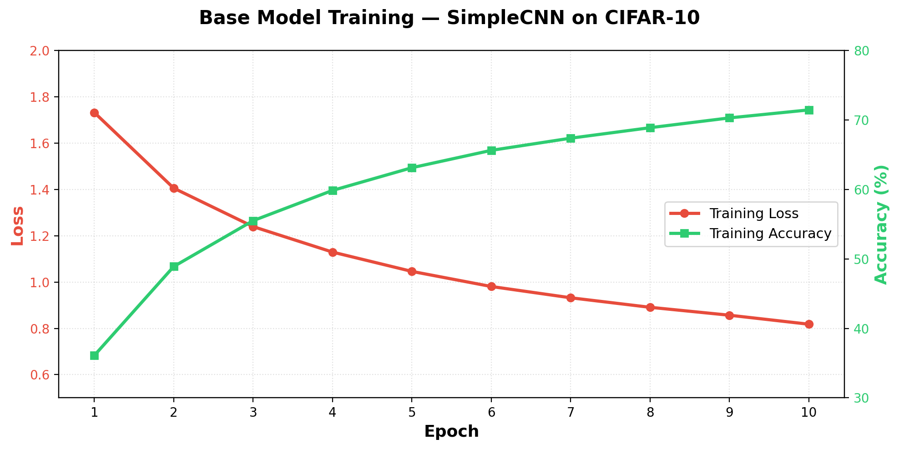
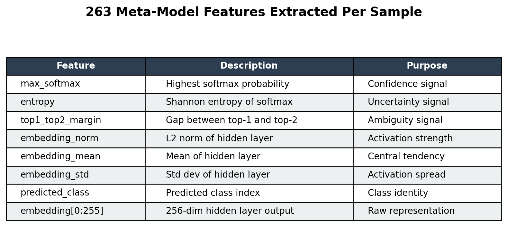
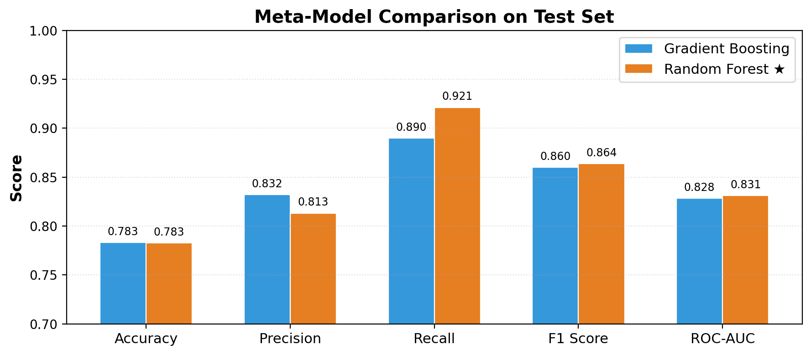
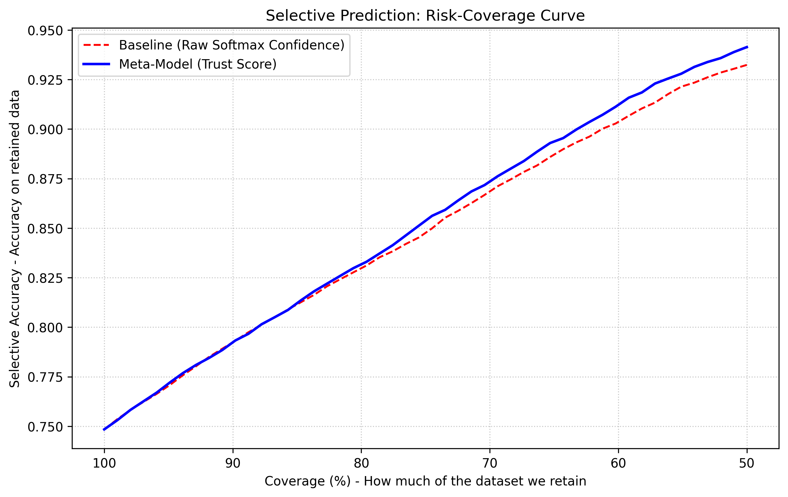

<div align="center">

# 🔍 Predicting Model Confusion

### A meta-model that learns when to trust — and when to second-guess — a classifier

[](https://python.org)
[](https://pytorch.org)
[](https://scikit-learn.org)

</div>

---

## 💡 What Is This?

This project builds a **"second opinion" model** that sits on top of a normal image classifier. The base model does the actual job of predicting _cat vs dog vs airplane_. The meta-model's only job is to look at how the base model behaved on a given input and decide:

> _Should we trust this prediction, or should we flag it for a human to check?_

This is part of a broader idea called **selective prediction** (sometimes called "learning to defer" or "human-AI deferral"). Instead of forcing an answer on every input, the system can say _"I'm not confident here — send this to a human or a more expensive model."_ This matters in any high-stakes setting (medical imaging, autonomous driving, fraud detection) where a wrong-but-confident answer is far more dangerous than an honest _"I don't know."_

---

## 🏗️ Architecture Overview

```
                    ┌─────────────────────┐
    Input Image ──▶ │   Base CNN Model    │──▶ Prediction: "Cat"
                    │  (CIFAR-10, 10 cls) │     Confidence: 0.92
                    └────────┬────────────┘
                             │
                      Internal Features
                    (embeddings, softmax,
                     entropy, margin...)
                             │
                             ▼
                    ┌─────────────────────┐
                    │  Meta-Model (GBT)   │──▶ Trust Score: 0.34
                    │  "Should we trust   │     Verdict: ⚠️ DEFER
                    │   this prediction?" │
                    └─────────────────────┘
```

---

## 📊 Project Results

| Metric | Value |
|---|---|
| **Base Model Accuracy** | 74.84% (10 epochs, SimpleCNN) |
| **Meta-Model (RandomForest)** | 78.30% accuracy |
| **Meta-Model ROC-AUC** | 0.8310 |
| **Meta-Model F1 Score** | 0.8639 |
| **Meta-Model Features** | 263 (7 handcrafted + 256 embedding) |

### Base Model Training



### Meta-Model Features



### Meta-Model Comparison



### Risk-Coverage Curve

The headline result — as we reject the riskiest predictions (lowest trust scores), accuracy on the remaining predictions climbs. **The meta-model outperforms the raw softmax confidence baseline** at coverage levels below ~75%, proving the "second opinion" approach works:



| Coverage | Meaning | Meta-Model Accuracy | Baseline (MCP) |
|---|---|---|---|
| 100% | Accept all predictions | ~75% | ~75% |
| 80% | Reject riskiest 20% | ~82% | ~82% |
| 70% | Reject riskiest 30% | ~88% | ~86% |
| 60% | Reject riskiest 40% | ~92% | ~90% |
| 50% | Reject riskiest 50% | **~94%** | ~91% |

---

## 📁 Project Structure

```
model-confusion-predictor/
├── README.md                    # This file
├── Steps.md                     # Step-by-step build log with screenshots
├── requirements.txt             # Python dependencies
├── src/
│   ├── data.py                  # CIFAR-10 loading & three-way split
│   ├── train_base.py            # Base CNN model definition & training
│   ├── extract_features.py      # Feature extraction from base model
│   ├── train_meta.py            # Meta-model (GradientBoosting) training
│   ├── evaluate.py              # Risk-coverage curve & evaluation
│   └── demo.py                  # Interactive demo (coming soon)
├── models/                      # Saved model weights (git-ignored)
│   ├── base_model.pt
│   └── meta_model.pkl
├── data/                        # CIFAR-10 dataset (git-ignored)
│   └── extracted/               # Pre-extracted features
├── outputs/
│   └── plots/                   # Generated evaluation plots
└── notebooks/
    └── exploration.ipynb        # (optional) Jupyter exploration
```

---

## 🚀 Quick Start

### 1. Clone & Install

```bash
git clone https://github.com/santu-1506/Predicting-Model-Confusion.git
cd Predicting-Model-Confusion
pip install -r requirements.txt
```

### 2. Run the Full Pipeline

```bash
# Step 1: Download CIFAR-10 & verify the three-way split
python src/data.py

# Step 2: Train the base CNN classifier (10 epochs)
python src/train_base.py

# Step 3: Extract features from the calibration & test sets
python src/extract_features.py

# Step 4: Train the meta-model (GradientBoosting)
python src/train_meta.py

# Step 5: Generate the risk-coverage curve
python src/evaluate.py
```

> ⏱️ Full pipeline takes ~30 minutes on CPU (most of it is Step 2: training).

---

## 🧠 The Theory (Why This Works)

### The Core Problem

Neural networks are known to be **poorly calibrated**. They can be 95% confident about a _wrong_ answer just as easily as a right one. The most common shortcut — **Maximum Class Probability (MCP)**, i.e. just using the highest softmax score — inflates confidence by default and gives high scores even on inputs the model is about to get wrong.

### A Better Signal: True Class Probability (TCP)

Instead of asking _"how confident was the model in whatever it predicted,"_ ask _"how much probability mass did the model actually put on the **correct** class?"_ This is called **True Class Probability (TCP)** (Corbiere et al., 2019).

TCP is a much cleaner signal, but the catch is obvious: at test time you don't know the true label. The trick is training a separate small model to _estimate_ what TCP would have been, using only signals available at inference time — like confidence, entropy, margin, and embedding statistics.

**That's exactly the meta-model in this project.** It's a TCP estimator using Gradient Boosting instead of a neural confidence head.

### The Three-Way Split (The Part People Get Wrong)

```
Base-train set  → trains the base classifier         (40,000 images)
Calibration set → trains the meta-model               (10,000 images)
Test set        → final evaluation only                (10,000 images)
```

If the meta-model trains on the same data the base model was trained on, the base model looks artificially confident and correct on almost everything (it's basically memorized it). The calibration set **must** be data the base model has never touched during training.

### The Important Rule to Remember

> During **training**, ground truth is used to label whether the base model was correct — that's how the meta-model learns. During **inference**, there is no ground truth available. The meta-model only ever sees confidence, entropy, margin, and embedding stats — it has never seen the true label at prediction time.

---

## 🔬 Research Background

This project is grounded in the work of **Tsiligkaridis (2020)** on failure prediction using Dirichlet networks. The paper's main contribution is an **Information Aware Dirichlet (IAD) network** — instead of outputting a single probability per class, it outputs concentration parameters of a Dirichlet distribution, letting the model express not just _"what's my best guess"_ but _"how much do I actually know here."_

Key takeaways from the literature:

| Concept | Description |
|---|---|
| **MCP** | Maximum Class Probability — the naive baseline (just use softmax confidence) |
| **TCP** | True Class Probability — a better learning target tied to ground truth |
| **IAD** | Information Aware Dirichlet — an uncertainty-aware base model architecture |
| **Selective Prediction** | The system is allowed to abstain when confidence is low |

The paper reports **AUROC of 90–94** on CIFAR-10 with IAD networks. This project uses a standard CNN (not IAD), so our numbers are expectedly lower — but the pipeline and methodology are identical.

---

## 🔮 Future Improvements

- [x] ~~**Richer meta-model features:** Add handcrafted uncertainty signals alongside raw embeddings~~ ✅ Done
- [ ] **Upgrade base model:** Replace SimpleCNN with ResNet-18 for higher base accuracy (~93%)
- [ ] **Dirichlet base model:** Implement IAD-style training for better uncertainty separation
- [ ] **Monte Carlo Dropout:** Use dropout at inference time for variance-based uncertainty
- [ ] **Interactive demo:** Build `demo.py` showing accept/defer decisions on sample images
- [ ] **Confusion matrix visualization:** Show which class pairs confuse the model most
- [ ] **Failure type breakdown:** Categorize predictions into four quadrants (high trust + correct, high trust + wrong, etc.)

---

## 📚 References

1. Tsiligkaridis, T. (2020). _Failure Prediction by Confidence Estimation of Uncertainty-Aware Dirichlet Networks._ MIT Lincoln Laboratory.
2. Corbiere, C., Thome, N., Bar-Hen, A., Cord, M., Perez, P. (2019). _Addressing Failure Prediction by Learning Model Confidence._ NeurIPS.
3. Hendrycks, D., Gimpel, K. (2017). _A Baseline for Detecting Misclassified and Out-of-Distribution Examples in Neural Networks._ ICLR.
4. Jiang, H., Kim, B., Guan, M., Gupta, M. (2018). _To Trust or Not to Trust a Classifier._ NeurIPS.
5. Sensoy, M., Kaplan, L., Kandemir, M. (2018). _Evidential Deep Learning to Quantify Classification Uncertainty._ NeurIPS.
6. Malinin, A., Gales, M. (2019). _Reverse KL-Divergence Training of Prior Networks._ NeurIPS.

---

<div align="center">

_Built as a deep learning project exploring selective prediction and model trustworthiness._

</div>
