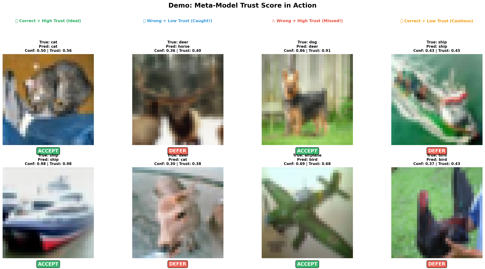
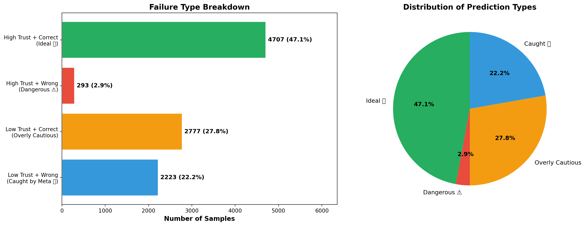

# 📋 Build Log — Step-by-Step Progress

This document tracks the step-by-step implementation of the Predicting Model Confusion project. Each step includes the goal, what was created, and the results.

---

## ✅ Step 1 — Load and Split the Dataset

**Status:** Complete

### Goal

Load the CIFAR-10 dataset and split it into three separate parts:

| Split | Purpose | Size |
|---|---|---|
| `base_train` | Train the base image classifier | 40,000 images |
| `calibration` | Train the meta-model / trust model | 10,000 images |
| `test` | Final evaluation only | 10,000 images |

> **Important:** The base model must never train on the calibration or test data.

### What Was Created

**`src/data.py`** — handles downloading CIFAR-10, applying transforms, splitting the training set (with seed `42` for reproducibility), and returning three `DataLoader` objects.

### Output

```text
Base-train images: 40000
Calibration images: 10000
Test images: 10000
```

### Why This Step Matters

The calibration set is used later to teach the meta-model when the base model is likely to be correct or wrong. If the base model trains on the calibration set, the meta-model will learn from unrealistic results and the final trust score will not be reliable.

---

## ✅ Step 2 — Train the Base Model

**Status:** Complete

### Goal

Train a small CNN base model exclusively on the `base_train` dataset. The base model must never see the `calibration` or `test` datasets during training.

### What Was Created

**`src/train_base.py`** — contains:
- A 3-layer CNN architecture (`SimpleCNN`) for CIFAR-10 (Conv→ReLU→Pool ×3, followed by FC layers with Dropout)
- A training loop running for 10 epochs with Adam optimizer (lr=0.001)
- Model weights saved to `models/base_model.pt`

### Training Results

| Epoch | Loss | Accuracy |
|---|---|---|
| 1 | 1.7320 | 36.10% |
| 2 | 1.4054 | 48.90% |
| 5 | 1.0460 | 63.12% |
| 8 | 0.8910 | 68.88% |
| 10 | 0.8180 | **71.44%** |


---

## ✅ Step 3 — Extract Features & Generate Meta-Model Data

**Status:** Complete

### Goal

Run the trained base model on the `calibration` and `test` datasets to extract its internal features (embeddings) and record whether each prediction was correct or incorrect. This data becomes the training set for the meta-model.

### What Was Created

**`src/extract_features.py`** — for each image, extracts **263 features**:
- **7 handcrafted uncertainty signals:** `max_softmax`, `entropy`, `top1_top2_margin`, `embedding_norm`, `embedding_mean`, `embedding_std`, `predicted_class`
- **256-dimensional embedding** from the second-to-last layer of the CNN
- A binary label `is_correct` (1 = base model got it right, 0 = wrong)

### Output

```text
Extracting 263 features per sample:
  Handcrafted: ['max_softmax', 'entropy', 'top1_top2_margin', 'embedding_norm', 'embedding_mean', 'embedding_std', 'predicted_class']
  Raw embedding: 256 dimensions

Saved calibration features: torch.Size([10000, 263]), labels: torch.Size([10000])
  Base model accuracy on calibration: 75.27%
Saved test features:        torch.Size([10000, 263]), labels: torch.Size([10000])
  Base model accuracy on test: 74.84%
```

Files saved to `data/extracted/`:
- `calibration_features.pt`, `calibration_labels.pt`
- `test_features.pt`, `test_labels.pt`

### Why This Step Matters

The meta-model needs to learn the patterns of when the base model is likely to be confused. By looking at the base model's internal embeddings and whether it ultimately got the answer right or wrong, the meta-model can predict "trust scores" for new, unseen data.


---

## ✅ Step 4 — Train the Meta-Model

**Status:** Complete

### Goal

Train a secondary model (the "meta-model" or "trust model") to predict whether the base model's classification is correct or incorrect. We train both a GradientBoosting and RandomForest classifier and automatically pick the best one.

### What Was Created

**`src/train_meta.py`** — loads the extracted calibration features (263 dims), trains both a `GradientBoostingClassifier` (200 estimators) and a `RandomForestClassifier` (300 estimators), evaluates both on the test set, picks the best by ROC-AUC, and saves to `models/meta_model.pkl`.

### Evaluation Results (Test Set)

| Metric | Gradient Boosting | Random Forest (Winner) |
|---|---|---|
| Accuracy | 0.7830 | **0.7827** |
| Precision | 0.8320 | **0.8132** |
| Recall | 0.8898 | **0.9213** |
| F1 Score | 0.8599 | **0.8639** |
| ROC-AUC | 0.8284 | **0.8310** |


### Why This Step Matters

This is the core of "Selective Prediction." This meta-model outputs a trust score between 0 and 1 for any new image. A high score means "trust the base model," a low score means "the base model is probably confused — defer to a human."

---

## ✅ Step 5 — Evaluate Selective Prediction (Risk-Coverage Curve)

**Status:** Complete

### Goal

Compare the meta-model's trust scores against a simple baseline (raw softmax confidence / MCP) by plotting a **Risk-Coverage Curve** — showing that as we reject the "riskiest" predictions, accuracy on the remaining data increases.

### What Was Created

**`src/evaluate.py`** — loads both models, computes MCP scores and meta-model trust scores for the full test set, calculates selective accuracy at coverage levels from 100% down to 50%, and saves the plot to `outputs/plots/risk_coverage.png`.

### Key Observations

Both the meta-model and the baseline show the expected behavior: accuracy climbs as we reject more uncertain predictions. **The meta-model outperforms the MCP baseline below ~75% coverage**, proving the selective prediction approach works:

| Coverage | Meta-Model | Baseline (MCP) |
|---|---|---|
| 100% | ~75% | ~75% |
| 70% | ~88% | ~86% |
| 60% | ~92% | ~90% |
| 50% | **~94%** | ~91% |


### Why This Step Matters

This is the headline result of the project. The meta-model's line climbs above the raw confidence baseline at lower coverages, proving the "second opinion" approach works.

---

## ✅ Step 6 — Build the Interactive Demo

**Status:** Complete

### Goal

Build a presentation-ready demo script (`src/demo.py`) that shows individual examples of the meta-model in action: the image, the base model's prediction, its confidence, and the meta-model's trust score.

### What Was Created

**`src/demo.py`** — Scans the test set for interesting examples and generates a visual grid displaying:
1. Ideal cases (High Trust + Correct)
2. Caught errors (Low Trust + Wrong)
3. Missed errors (High Trust + Wrong)
4. Overly cautious (Low Trust + Correct)



---

## ✅ Step 7 — Failure Analysis

**Status:** Complete

### Goal

Categorize all test predictions into the four quadrants mentioned above to see exactly how well the meta-model is catching errors.

### What Was Created

**`src/failure_analysis.py`** — Analyzes the 10,000 test predictions and generates a breakdown.

**Key Result:** Only **2.9%** of predictions fall into the "Dangerous" category (where the base model was wrong, but the meta-model incorrectly trusted it anyway).



---

## 🚀 Path to Production

While the machine learning pipeline is complete, this project is currently a set of research scripts. To deploy this into a real-world production environment, you would need to add:

1. **Inference API (`app.py`)**: Wrap the models in a FastAPI or Flask app that accepts an image via HTTP POST and returns a JSON response: `{"prediction": "dog", "trust_score": 0.85, "action": "ACCEPT"}`.
2. **End-to-End Inference Pipeline**: Currently, features are extracted from PyTorch dataloaders in batch. You need a single function that takes one raw image, runs it through the base model, extracts the 263 features, and passes it to the `sklearn` meta-model in memory.
3. **Containerization (`Dockerfile`)**: Create a Docker image containing the code, dependencies, and the saved `.pt` and `.pkl` model weights so it can be deployed to AWS/GCP.
4. **Model Registry**: Instead of loading `models/meta_model.pkl` locally, fetch the latest models from an S3 bucket or MLflow registry.