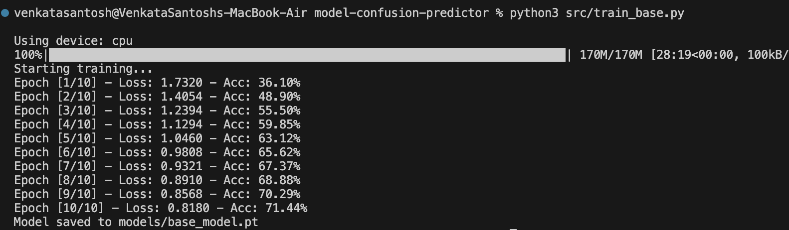
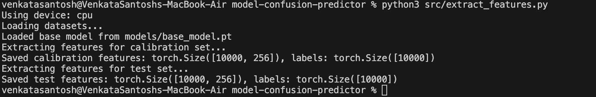
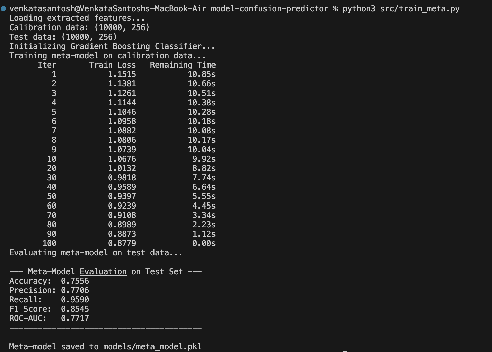
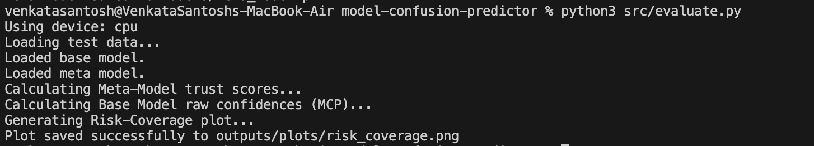

# Step 1 - Load and Split the Dataset

## Goal

Load the CIFAR-10 dataset and split it into three separate parts:

```text
base_train   -> used to train the base image classifier
calibration  -> used to train the meta-model / trust model
test         -> used only for final evaluation
```

The important rule is that the base model must never train on the calibration or test data.

## What to Create

Create this file:

```text
src/data.py
```

This file should handle:

1. Downloading/loading CIFAR-10.
2. Applying basic image transforms.
3. Splitting the original CIFAR-10 training set into:
   - `40,000` images for `base_train`
   - `10,000` images for `calibration`
4. Keeping the CIFAR-10 test set as the untouched final `test` set.
5. Returning PyTorch `DataLoader` objects for all three sets.

## Install Required Libraries

Create a `requirements.txt` file with:

```text
torch
torchvision
scikit-learn
pandas
numpy
matplotlib
tqdm
joblib
```

Then install them:

```bash
pip install -r requirements.txt
```

## Suggested Code Structure

Inside `src/data.py`, create a function like:

```python
def get_dataloaders(batch_size=128, num_workers=2):
    """
    Returns:
        base_train_loader
        calibration_loader
        test_loader
    """
```

The split should look like this:

```python
base_train_size = 40000
calibration_size = 10000

base_train, calibration = random_split(
    full_train_dataset,
    [base_train_size, calibration_size],
    generator=torch.Generator().manual_seed(42),
)
```

Use a fixed random seed, such as `42`, so the split is reproducible.

## Expected Output

When Step 1 is complete, you should be able to run a quick check and see:

```text
Base-train images: 40000
Calibration images: 10000
Test images: 10000
```

## Why This Step Matters

The calibration set is used later to teach the meta-model when the base model is likely to be correct or wrong. If the base model trains on the calibration set, the meta-model will learn from unrealistic results and the final trust score will not be reliable.

---

# Step 2 - Train the Base Model

## Goal

Train a small CNN base model exclusively on the `base_train` dataset. The base model must never see the `calibration` or `test` datasets during training.

## What to Create

Create `src/train_base.py` containing:
1. A basic CNN architecture for CIFAR-10 (e.g., 2-3 conv layers, followed by fully connected layers).
2. A training loop that runs for a few epochs (e.g., 10 epochs).
3. Code to save the trained model weights to `models/base_model.pt`.


---

# Step 3 - Extract Features & Generate Meta-Model Data

## Goal

Run the trained base model on the `calibration` and `test` datasets to see where it succeeds and where it fails. We will extract its internal features (embeddings) and record whether its predictions were correct or incorrect. This information will form the dataset used to train our trust/meta-model.

## What to Create

Create `src/extract_features.py` containing:
1. Code to load the trained `models/base_model.pt`.
2. A function that runs the model over the `calibration` and `test` dataloaders.
3. For each image, save:
   - The intermediate features/embeddings from the base model (e.g., from the second-to-last layer).
   - A binary label `is_correct` (1 if the base model's prediction was right, 0 if wrong).
4. Save the extracted features and labels into a format suitable for training the meta-model (e.g., NumPy `.npy` files or PyTorch `.pt` files in a `data/extracted/` directory).



## Why This Step Matters

The meta-model needs to learn the patterns of when the base model is likely to be confused. By looking at the base model's internal embeddings and whether it ultimately got the answer right or wrong on the calibration set, the meta-model can predict "trust scores" for new, unseen data in the test set.

---

# Step 4 - Train the Meta-Model

## Goal

Train a secondary model (the "meta-model" or "trust model") to predict whether the base model's classification is correct or incorrect. We will use a Gradient Boosting Classifier from `scikit-learn` to learn from the internal features we extracted in Step 3.

## What to Create

Create `src/train_meta.py` containing:
1. Code to load the extracted features and labels from the `data/extracted/` directory (specifically the `calibration` set).
2. Initialization of a `GradientBoostingClassifier` (or `RandomForestClassifier`).
3. Training the classifier on the calibration features, with the target being the `is_correct` labels.
4. Evaluation of the meta-model on the test features (to see how well it predicts the base model's successes and failures on unseen data).
5. Saving the trained meta-model weights to `models/meta_model.pkl` using `joblib`.

## Expected Output

When you run this step, you should see the training process for the Gradient Boosting model and some basic metrics (like Accuracy and ROC-AUC) on the test set.



## Why This Step Matters

This is the core of "Selective Prediction". This meta-model will output a "trust score" between 0 and 1 for any new image. A high score means "trust the base model," while a low score means "the base model is probably confused, defer to a human."

---

# Step 5 - Evaluate Selective Prediction (Risk-Coverage Curve)

## Goal

Now that we have a trained meta-model that predicts "trust scores," we need to prove that it actually works. We will compare our meta-model's trust scores against a simple baseline (raw softmax confidence, also known as Maximum Class Probability or MCP). 
The headline result will be a **Risk-Coverage Curve**: a plot showing that as we reject the "riskiest" predictions (according to our trust score), the accuracy of the remaining predictions increases!

## What to Create

Create `src/evaluate.py` containing:
1. Code to load the `test` dataset, the trained `base_model.pt`, and the trained `meta_model.pkl`.
2. Run the test set through the base model to get its predictions and raw confidence (the MCP baseline).
3. Extract features for the test set and run them through the meta-model to get the `trust_scores`. (We already have test features in `data/extracted/test_features.pt` but we'll also need the raw confidence scores for the baseline).
4. Create a function that sorts the test predictions by their score, and progressively rejects the lowest scores (from 100% coverage down to 50% coverage).
5. Plot two lines on a graph: 
   - Selective Accuracy vs. Coverage using the Meta-Model Trust Score.
   - Selective Accuracy vs. Coverage using the Raw Softmax Confidence (Baseline).
6. Save the plot to an `outputs/plots/` directory as `risk_coverage.png`.

## Expected Output

You should see a graph where the x-axis is Coverage (100% down to 50%) and the y-axis is Accuracy. As coverage goes down, accuracy should climb. Ideally, your Meta-Model's line climbs faster and higher than the baseline!



## Why This Step Matters

This proves the entire concept of the project! If the meta-model's line is higher than the raw confidence line, it means your meta-model is better at identifying when the base model is wrong than the base model itself. This validates the "second opinion" selective prediction approach.

---

# Step 6 - Build the Interactive Demo

## Goal

To make this project presentation-ready, we need to show individual examples of the Meta-Model in action. We will build a small demo script that pulls a few random test images and displays the image alongside the Main Model's guess and the Meta-Model's trust score.

## What to Create

Create `src/demo.py` containing:
1. Code to load a few random images from the test dataset.
2. Run them through the `base_model` to get the prediction and raw confidence.
3. Run their features through the `meta_model` to get the trust score.
4. Use `matplotlib` to plot the image and print the results side-by-side. 
   - We specifically want to highlight cases where the **base model is wrong, but the meta-model correctly gives it a low trust score** (meaning it successfully caught the error!).

## Expected Output

When you run the demo, it should pop up a visual showing the image, the true label, what the model guessed, and what the meta-model thought about that guess. 

## Why This Step Matters

Metrics like ROC-AUC and Risk-Coverage curves are great for data scientists, but an interactive demo is how you get normal people (and recruiters!) to instantly understand why your project is valuable. It shows the "Second Opinion" AI doing its job in real-time.